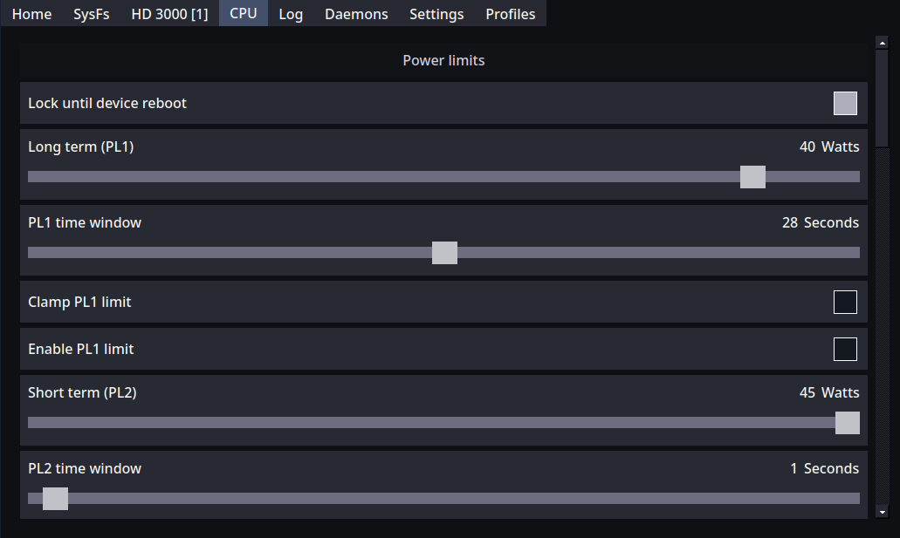

# PowerTunerConsole


PowerTuner gamepad first, touch friendly, client for handhelds and couch gaming.

For a command-line client, see [PowerTunerCLI](https://github.com/PowerTuner/PowerTunerCLI)

For a classic desktop client, see [PowerTunerClient](https://github.com/PowerTuner/PowerTunerClient)

## Accessibility

### Text To Speech (TTS)

PowerTunerConsole implements Text To Speech, which is enabled by default.

When enabled, section titles are focusable, so they can be spoken, but without focus effect.

TTS can be disabled in **Settings** tab.

#### Windows TTS setup

No setup is required in Windows.

#### Linux TTS setup

If your distro does not come with TTS pre-configured, you must install the required packages yourself.

Please check your distro wiki.

Known working setups:

**ArchLinux**

Install the required packages

```bash
sudo pacman -S speech-dispatcher espeak-ng espeakup
```

start and enable **speech-dispatcher** systemd service.

see [ArchLinux speech-dispatcher wiki](https://wiki.archlinux.org/title/Speech_dispatcher) for more info.

## Controls

The app can be controlled with both, keyboard and gamepad.

### Keyboard

Please note that **key combos are not available when using a keyboard**.

This is a gamepad first UI, keyboard controls were made available for easy of development or as a fallback in rare cases.

Keyboard controls remap is available in **Settings** tab, it does apply to all connected keyboards.

### Gamepad

Gamepad support is provided by latest [SDL](https://github.com/libsdl-org/SDL).

In addition, [SDL GameControllerDB](https://github.com/mdqinc/SDL_GameControllerDB) is built-in and loaded on boot.

You can override the built-in **GameControllerDB** by creating or editing the file

```text
<powerTuner client folder>\sdl_gamepad_db.txt
```

Replace _**\<powerTuner client folder\>**_ with PowerTunerConsole data path, which is printed in _Log_ tab on boot.

Usually, the path should be:

```text
Windows:
C:\Users\<username>\AppData\Local\PowerTuner\console

Linux:
/home/<username>/.local/share/PowerTuner/console
```

If you have run PowerTunerConsole at least once, that file already exists and it is a copy of the loaded built-in database.

If this file is not found, the built-in **GameControllerDB** will be loaded and written to that file.

Reload gamepad mappings from **Settings** tab to apply the changes immediately.

Gamepad controls remap is available in **Settings**, each gamepad has its own mapping.

## Overlay mode

PowerTunerConsole can be used as an overlay app, that is, it is a _always on top_ window.

Change **Application quit behaviour** in **Settings** to either **Floating icon** or **Close to tray**. 

This allows to show/hide PowerTunerConsole window with a gamepad combo (**Application button combo** in **Settings**).

You may need to set games/apps window to something different than _Exclusive fullscreen_,
since it may not allow PowerTunerConsole to be shown on top.

### Floating icon controls

Floating icon can be moved everywhere in your screen.

```text
Left mouse click: show PowerTunerConsole
Left mouse hold: move the icon
Right mouse click: quit PowerTunerConsole
```

## MicroKeyboard

A gamepad controlled micro keyboard is available and automatically shown on text input activation.

Micro keyboard is the best option for these cases, easy to use, gamepad friendly and does not hide big chunks of the UI.

### MicroKeyboard controls

MicroKeyboard uses the gamepad mapping you have set, in **Settings**, for the gamepad controlling it.

Reported here, are the labels of the mapping, as found in **Settings**, not the actual keys.

```text
Left:                   Previous
Fast left:              Previous (5 steps)
Right:                  Next
Fast rigth:             Next (5 steps)
Scroll up:              Anchor MicroKeyboard to up corner from current corner
Scroll down:            Anchor MicroKeyboard to bottom corner from current corner
Scroll left:            Anchor MicroKeyboard to left corner from current corner
Scroll right:           Anchor MicroKeyboard to right corner from current corner
Input mode switch:      Lowercase/Uppercase
Previous tab:           Send backspace key
Next tab:               Send delete key (clear input text)
Click:                  Send selected key
Back:                   Close micro keyboard
```

Special MicroKeyboard keys:

```text
[ ]:        Space
RET:        Return (enter key)
```

## Input mode switch

This is a special action you can activate on sliders, when they are focused,
that allows to switch between a slider input or text input, depending on your needs.

## Build

clone this repo:

```bash
git clone --recursive https://github.com/PowerTuner/PowerTunerConsole.git
```

Build options:

```text
WITH_INTEL
enable building of client UI for Intel CPU settings, default ON

WITH_AMD
enable building of client UI for AMD CPU settings, default ON
```

### Linux

requirements:

- gcc or clang
- cmake
- qt6-base
- qt6-speech

```text
$ cd PowerTunerConsole
$ cmake -B build -DCMAKE_BUILD_TYPE=Release
$ make -C build
```

### Windows

requirements:

- Visual Studio 2022 with the component **Desktop development with C++** installed
- [Windows terminal](https://apps.microsoft.com/detail/9n0dx20hk701)
- [latest Qt](https://www.qt.io/development/download-qt-installer-oss) with **MSVC 2022 64bit** installed

Open terminal and create a new instance of **Developer Command Promp for VS 2022** or **Developer PowerShell for VS 2022**.

_Tab completition feature is only available in PowerShell_

```text
$ cd PowerTunerConsole
$ cmake -B build -DCMAKE_BUILD_TYPE=Release -DCMAKE_PREFIX_PATH="<path to Qt>\msvc2022_64\lib\cmake" -G "Ninja"
$ ninja -C build
```

Replace _\<path to Qt\>_ with your Qt root path, default is **C:\Qt\\<Qt version\>**

## Custom range limits for settings

Some settings like TDP or GPU clock, use a json database with min/max ranges.

Built-in ranges are safe, not exceeding the default/recommended values for the device.

To create your own ranges override, see instructions [here](https://github.com/PowerTuner/PowerTunerClient#custom-input-ranges-for-settings).

---



_Linux Intel device screenshot_
